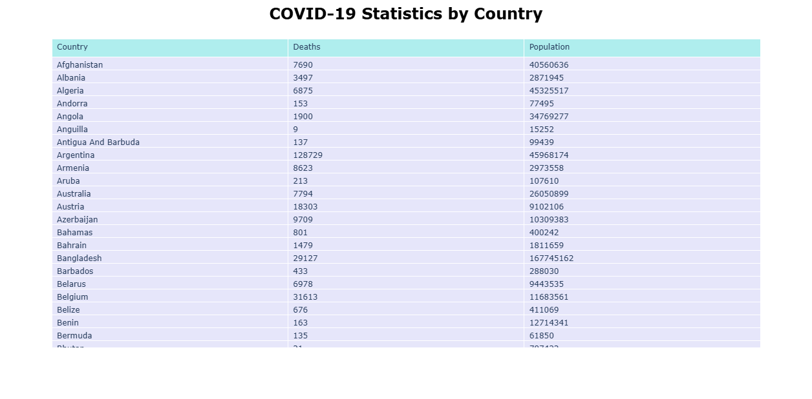

# COVID-19-deaths

## Objective
This project uses python to assess the global impact of COVID-19. The number of deaths per 100,000 people is used as a normalised meteric to measure the severity by country. Since the onset of the pandemic in 2020, COVID-19 has placed immense strain on golbal economies and healthcare systems. This project aims to demonstrate the application of data analysis to a real-world healthcare large data-set, providing insight into how quantitative methods can support public healthcare decisions.

The analysis includes data processing, statistical calculations, and visualisation to identify trends and compare outcomes across countries. A case study of the most affected country is then used to explore factors that may have contributed to the high COVID mortality rate. This illustrates how quantitative analysis can be applied to investigate complex healthcare challenges.

## The Code
### Libraries Used


 
Importing the libraries used in this project. 
```python
#import python modules
import matplotlib.pyplot as plt
import pandas as pd
import numpy as np
import plotly.express as px
import plotly.io as pio
import plotly.graph_objects as go
```

Extract the columns, country name, total number of deaths, and population from the imported global corona virus data.  Make a new data frame with the extracted columns, then use Plotly to display it as a table.
```python
#import, sort and create new data frame
Data = pd.read_csv("worldometer_coronavirus_summary_data.csv")
view = Data[['country', 'total_deaths', 'population']]
view = view.rename(columns={'country': 'Country', 'total_deaths': 'Deaths', 'population': 'Population' })

fig3 = go.Figure(data=[go.Table(
    header=dict(values=list(view.columns),
                fill_color='paleturquoise',
                align='left'),
    cells=dict(values=[view.Country, view.Deaths, view.Population],
               fill_color='lavender',
               align='left'))
])
fig3.update_layout(
    title=dict(
        text="<b>COVID-19 Statistics by Country</b>", # HTML tags like <b> work for bolding
        font=dict(size=24, color="black"),            # Change font size and color
        x=0.5,                                        # Centers the title (0 = left, 1 = right)
        xanchor='center'
    ),
    margin=dict(t=60) # Adds top margin space so the title doesn't overlap the table
)

pio.renderers.default = "browser"
fig3.show()
```
<p align="center">


The total number of deaths per 100,000 persons in every country can be determined using this data. The data frame is then updated with this value, and a global map is produced.  The colour gradient shows the COVID-19 outbreak per country in terms of fatalities.

```python
#calculate total deaths per 100,000 in each country and display as colored map 
def func(group):
    rate = (group['Deaths']/group['Population']) * 100000
    return rate
country_rate = (view.groupby('Country').apply(func, include_groups=False)).reset_index(name='Deaths per 100,000')

fig = px.choropleth(
    country_rate,
    locations="Country",
    locationmode="country names",         
    color="Deaths per 100,000",              
    hover_name="Country",           
    color_continuous_scale="Reds", 
    title="Covid 19 deaths per 100,000 by country 2020",
    scope="world",                
    projection="natural earth"
)

fig.update_layout(
    geo=dict(showframe=False, showcoastlines=True),
    margin=dict(l=0, r=0, t=50, b=0)
)

pio.renderers.default = "browser"
fig.show()
```
<p align="center">

    
According to the map, South America had the highest number of COVID-19 deaths per 100,000 persons in 2022. A bar chart of COVID-19 deaths by South American countries is made by zoning into this area.

```python
#bar graph of COVID-19 fatality data in South America 
Data1 = Data[Data["continent"] == 'South America']
view1 = Data1[['country', 'total_deaths', 'population']]
view1 = view1.rename(columns={'country': 'Country', 'total_deaths': 'Deaths', 'population': 'Population' })

sa_rate = (view1.groupby('Country').apply(func, include_groups=False))
sa_rate = sa_rate.reset_index(name='Deaths per 100,000')

fig1 = px.bar(sa_rate, y='Deaths per 100,000', x='Country', text_auto='.2s',
            title="Total Deaths per 100,000 due to COVID 19 in South America")
fig1.update_traces(textfont_size=12, textangle=0, textposition="outside", cliponaxis=False)
pio.renderers.default = "browser"
fig1.show()
```
<p align="center">


The bar chart shows that Peru had the highest death toll per 100,000 population in 2022. Further insights into the impact of COVID-19 in Peru can be gained by analyzing the trend in death cases from the start of the pandemic in 2020. **_[worldometer_coronavirus_daily_data.csv](data-and-code/worldometer_coronavirus_daily_data.csv)_**
```python
# Daily data in Peru 
df = pd.read_csv("worldometer_coronavirus_daily_data.csv")
df["date"] = pd.to_datetime(df["date"])

peru_df = df[
    (df["country"] == "Peru") &
    (df["date"] >= "2020-02-15") &
    (df["date"] <= "2022-05-14")
]

fig = px.scatter(
    peru_df,
    x="date",
    y="daily_new_deaths",
    trendline="lowess",
    trendline_options={"frac": 0.03},
    title="Daily New Deaths in Peru (2020–2022)"
)

fig.show()
```

<p align="center">


## Conclusion
The analysis identified Peru as the country with the highest reported COVID-19 mortality rate per 100,000 population in the dataset. A case study of Peru demonstrated how quantitative analysis can be used to investigate the relationship between mortality outcomes and the country's healcare system. The findings suggest that high mortality rates were associated with multiple factors, including poor healthcare infrustructure. During the early stages of the pandemic, Peru had fewer than 1,500 ICU beds for a population of more than 32 million, placing significant strain on the healthcare system. Although early public health interventions, including lockdowns, were implemented, subsequent waves of infection continued to result in substantial mortality.
 
This project demonstrates the value of data analysis and scientific computing in exploring large healthcare datasets and communicating quantitative findings through clear visualisation and statistical comparison. It highlights how population-level data can be used to support the investigation of public health challenges.

### References
- https://ourworldindata.org/key-charts-understand-covid-pandemic
- https://pmc.ncbi.nlm.nih.gov/articles/PMC10986737/
- https://pmc.ncbi.nlm.nih.gov/articles/PMC8045664/
- https://www.unicef.org/media/92111/file/UNICEF-Peru-COVID-19-Situation-Report-No.-10-End-of-year-2020.pdf

[**_[View full python code](data-and-code/COVID.py)_**]
